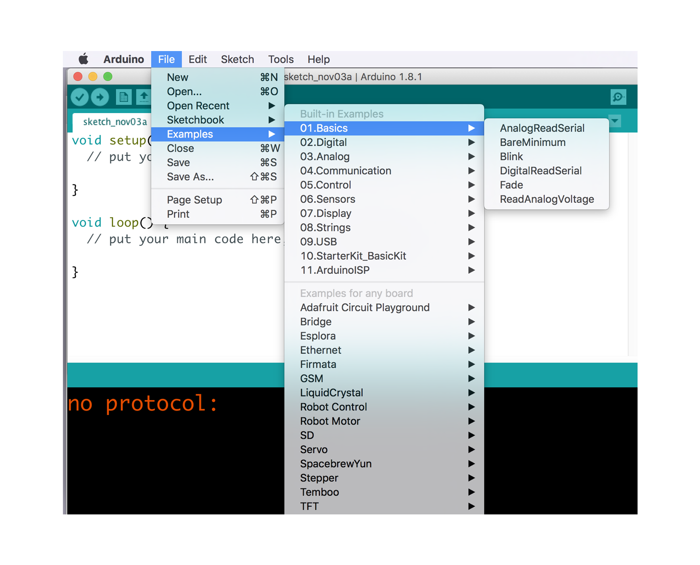

# Introduction to Arduino

Workshop by Arielle Hein  
Friday, November 3rd 2017

TAM Workshop  
University of Colorado Boulder, ATLAS Institute

## What is Arduino?

### History & Context

Arduino is an open-source electronics platform based on easy-to-use hardware and software. Arduino boards are able to read **inputs** - light on a sensor, a finger on a button, or a Twitter message - and turn it into an **output** - activating a motor, turning on an LED, publishing something online. You can tell your board what to do by sending a set of instructions to the microcontroller on the board. To do this, you use the [Arduino programming language](https://www.arduino.cc/en/Reference/HomePage), and the [Arduino Software (IDE)](https://www.arduino.cc/en/Main/Software), based on [Processing](https://processing.org/). Read more about Arduino [here](https://www.arduino.cc/en/Guide/Introduction).

[Watch](https://www.youtube.com/watch?v=UoBUXOOdLXY) Massimo Banzi, co-founder of Arduino, explain this easy-to-use open-source microcontroller that's inspired thousands of people around the world to make the coolest things they can imagine -- from toys to satellite gear.

Over the years Arduino has been the brain of thousands of projects, from everyday objects to complex scientific instruments. A worldwide community of makers - students, hobbyists, artists, programmers, and professionals - has gathered around this **open-source platform**, contributing to an incredible knowledge base.

When I talk about Arduino, I think of it in three different ways. First, Arduino is a piece of the hardware. There is a line of Arduino boards that can be used as the brains of a project. Second, Arduino is a programming language and development environment that makes working with inputs and outputs extremely accessible. Finally, Arduino is a community of engineers, artists, designers and makers of all types. The vibrant community is partly what makes Arduino so special.

There are many other microcontrollers and microcontroller platforms, but Arduino offers several important advantages:
+ **Inexpensive**
+ **Cross-platform**
+ **Simple, clear programming environment**
+ **Open source and extensible software**
+ **Open source and extensible hardware**

### Example Projects
+ Jen Lewin, [Sidewalk Harp](https://www.youtube.com/watch?v=jXBtkfPY2D0 )
+ Danny Rozin, [Wooden Mirror](https://vimeo.com/101408845)
+ [Opentrons](https://www.kickstarter.com/projects/932664050/opentrons-open-source-rapid-prototyping-for-biolog)
+ Simone Giertz, [Useless Robots](https://www.youtube.com/watch?v=UlP4Z_pWhKo)

 

## Setup & Resources

### Helpful Resources
+ The [ITP Physical Computing Blog](https://itp.nyu.edu/physcomp) is packed with labs, write-ups, videos, and tutorials for everything p-comp (incluing both electronics and programming).
+ Especially useful for beginners on the ITP Phys Comp site is the [Physical Computing Videos](https://itp.nyu.edu/physcomp/videos/videos-digital-and-analog-input-and-output/)
+ Both [Adafruit](https://www.adafruit.com/) and [Sparkfun]() have huge collections of tutorials and resources on their websites. Both have Learn and Blog sections that feature projects and examples. [Instructables](https://www.instructables.com/) is another place to check for Arduino project guides.
+ [Electronics Club](https://electronicsclub.info/) is a site written by beginners but used my many as a reference for anyone wishing to learn about electronics or build simple projects.
+ [Adafruit's Guide to Soldering](https://learn.adafruit.com/adafruit-guide-excellent-soldering) is very helpful for fabrication things!

helpful tools for physical computing

using a breadboard

## Hardware Setup

Today, we are using the Sparkfun Redboard, which is Sparkfun's equivalent of the Arduino Uno.

 

 

We will be building our circuit on a Breadboard.

 

Sparkfun has a helpful, more in-depth tutorial on [How to use a breadboard](https://learn.sparkfun.com/tutorials/how-to-use-a-breadboard)

 

## The Arduino Programming Environment

### The Arduino IDE

Visit the [Arduino Software Page](https://www.arduino.cc/en/Main/Software) and find the link to Download the Arduino IDE. Download and install for your specific platform. 

**Compile** - is used to compile your code before uploading to the board. 
**Upload** - transfers your program to the mircocontroller. Once the upload is complete, you will receive feedback in the bottom of the window. 
**setup()** - this functions executes once when your program starts. 
**loop()** - this runs continually as long as your program is running. this is where you will read and write data. 
**serial mintor** - useful for debugging, reading sensor values, and for sending and receiving serial data. in order to use the serial monitor, you must initialize serial communication in the setup function. 

Built into the Arduino IDE is useful example code. To access this, click File > Examples. 

## Inputs

## Outputs

## Going Further
