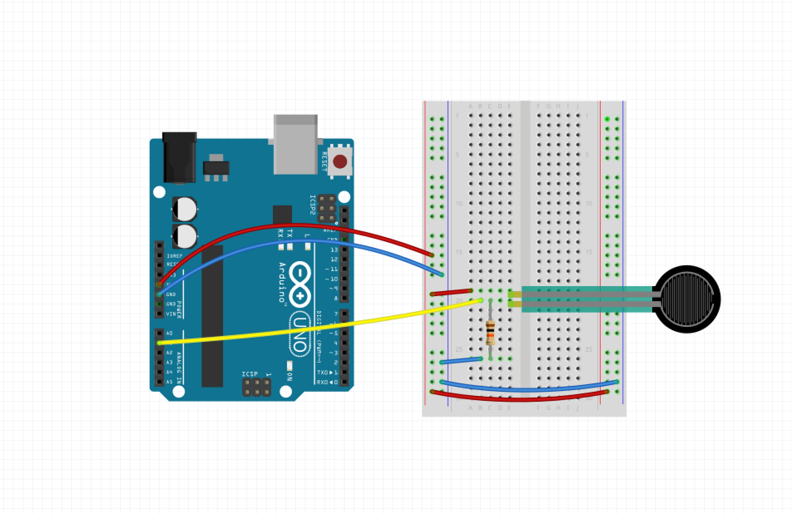

# Introduction to Arduino

TAM Workshop  
University of Colorado Boulder, ATLAS Institute

Workshop by Arielle Hein

## What is Arduino?

### History & Context

Arduino is an open-source electronics platform based on easy-to-use hardware and software. Arduino boards are able to read **inputs** - light on a sensor, a finger on a button, or a Twitter message - and turn it into an **output** - activating a motor, turning on an LED, publishing something online. You can tell your board what to do by sending a set of instructions to the microcontroller on the board. To do this, you use the [Arduino programming language](https://www.arduino.cc/en/Reference/HomePage), and the [Arduino Software (IDE)](https://www.arduino.cc/en/Main/Software), based on [Processing](https://processing.org/). Read more about Arduino [here](https://www.arduino.cc/en/Guide/Introduction).

[Watch](https://www.youtube.com/watch?v=UoBUXOOdLXY) Massimo Banzi, co-founder of Arduino, explain this easy-to-use open-source microcontroller that's inspired thousands of people around the world to make the coolest things they can imagine -- from toys to satellite gear.

Over the years Arduino has been the brain of thousands of projects, from everyday objects to complex scientific instruments. A worldwide community of makers - students, hobbyists, artists, programmers, and professionals - has gathered around this **open-source platform**, contributing to an incredible knowledge base.

When I talk about Arduino, I think of it in three different ways. First, Arduino is a piece of the hardware. There is a line of Arduino boards that can be used as the brains of a project. Second, Arduino is a programming language and development environment that makes working with inputs and outputs extremely accessible. Finally, Arduino is a community of engineers, artists, designers and makers of all types. The vibrant community is partly what makes Arduino so special.

There are many other microcontrollers and microcontroller platforms, but Arduino offers several important advantages:
+ **Inexpensive**
+ **Cross-platform**
+ **Simple, clear programming environment**
+ **Open source and extensible software**
+ **Open source and extensible hardware**

### Example Projects
+ Jen Lewin, [Sidewalk Harp](https://www.youtube.com/watch?v=jXBtkfPY2D0 )
+ Danny Rozin, [Wooden Mirror](https://vimeo.com/101408845)
+ Yingjie Bei and Yifan Hu, [Moon Phases](http://www.yingjiebei.com/Moon-Phases)
+ Rebecca Leiberman and Nick Bratton, [RootNote](https://www.rebeccalieberman.com/root-note/)
+ Ella Dagan, [The Coatroom](https://www.elladagan.com/the-cloakroom)
+ Jingwen Zhu, [Heart on my dress](http://www.jingwen-zhu.com/#/my-heart-on-my-dress/)
+ Simone Giertz, [Useless Robots](https://www.youtube.com/watch?v=UlP4Z_pWhKo)
+ [Opentrons](https://www.kickstarter.com/projects/932664050/opentrons-open-source-rapid-prototyping-for-biolog)

 

## Setup & Resources

### Helpful Resources
+ The [ITP Physical Computing Blog](https://itp.nyu.edu/physcomp) is packed with labs, write-ups, videos, and tutorials for everything p-comp (incluing both electronics and programming).
+ Especially useful for beginners on the ITP Phys Comp site is the [Physical Computing Videos](https://itp.nyu.edu/physcomp/videos/videos-digital-and-analog-input-and-output/)
+ Both [Adafruit](https://www.adafruit.com/) and [Sparkfun]() have huge collections of tutorials and resources on their websites. Both have Learn and Blog sections that feature projects and examples. [Instructables](https://www.instructables.com/) is another place to check for Arduino project guides.
+ [Electronics Club](https://electronicsclub.info/) is a site written by beginners but used my many as a reference for anyone wishing to learn about electronics or build simple projects.
+ [Adafruit's Guide to Soldering](https://learn.adafruit.com/adafruit-guide-excellent-soldering) is very helpful for fabrication things!

 

## Hardware Setup

Today, we are using the Sparkfun Redboard, which is Sparkfun's equivalent of the Arduino Uno. Read more about the [Arduino Uno vs. Redboard here](https://learn.sparkfun.com/tutorials/redboard-vs-uno?_ga=2.63984172.2074834900.1509591674-603825142.1485451985).

 

 

We will be building our circuit on a Breadboard.

Before beginning any project, the first thing we want to do is setup our breadboard so that it is live with power and ground. Use Jumper Wires to connect your Redboard and your Breadboard together like this:

 

Sparkfun has a helpful, more in-depth tutorial on [How to use a breadboard](https://learn.sparkfun.com/tutorials/how-to-use-a-breadboard)

 

## The Arduino Programming Environment

### The Arduino IDE

Visit the [Arduino Software Page](https://www.arduino.cc/en/Main/Software) and find the link to Download the Arduino IDE. Download and install for your specific platform. 

**Compile** - is used to compile your code before uploading to the board.  
**Upload** - transfers your program to the mircocontroller. Once the upload is complete, you will receive feedback in the bottom of the window.  
**setup()** - this functions executes once when your program starts.  
**loop()** - this runs continually as long as your program is running. this is where you will read and write data.  
**serial mintor** - useful for debugging, reading sensor values, and for sending and receiving serial data. in order to use the serial monitor, you must initialize serial communication in the setup function. 

Built into the Arduino IDE is useful example code. To access this, click File > Examples. 

## Inputs

Inputs are your sensors - components that read a signal from the physical world and translate that into something that our microcontroller or computer can read. There are two kinds of inputs that we use with Arduino: **digital** and **analog**. 

### Digital Inputs

A digital input has a discreet number of possible inputs, usually only 0 or 1. We will use a momentary push button to demonstrate this. The button has two possible states, on and off. 

To read a digital input, we use the Arduino function [`digitalRead()`](https://www.arduino.cc/en/Reference/DigitalRead)

### Analog Inputs

An analog input has an infiinte number of possible input values within a particular range. Analog inputs represent changing voltages. When we're using Arduino, we're working with a 5V system, so an incoming analog sensor can offer any possible value between 0V and 5V. A slider is a good example of an analog input. 

The Arduino Uno and Sparkfun Redboard (which we are using) include a component called an Analog-to-Digital Converter (or ADC) that allow us to read incoming analog signals. The Arduino uses a 10-bit ADC, which means that we will receive values betwen 0-1023.

To read an analog input, we use the Arduino function [`analogRead()`](https://www.arduino.cc/en/Reference/AnalogRead)

### The Serial Monitor

It is often helpful to be able to print the sensor values we're receiving, so that we can test if things are working and so that we can figure out what kind of sensor values we're able to work with. The **Serial Monitor** is helpful for this. 

In order to use the Serial Monitor, we first need to initialize serial communication. Do that by adding the following line in your setup function:

`Serial.begin(9600)`

Then, after you have read your sensor value, you can print that to the serial monitor, using [`Serial.println()`](https://www.arduino.cc/en/Serial/Println). If you would like to print multiple values, you may find it useful to format your message using [`Serial.print()`](https://www.arduino.cc/en/Serial/Print) as well (this function does not include a built in new line + carriage return). 

 

## Outputs

Outputs fall into two categories also, digital and analog. 

### Digital Outputs

Like inputs, digital outputs have a finite number of possible values. In the context of what we'll be workign with in Arduino, they will be either on or off. A good example of this would be turning an LED on or off. To program a digital output, use the function [`digitalWrite()`](https://www.arduino.cc/en/Reference/DigitalWrite). You can pass the `digitalWrite()` function a value of 0 or 1, or also the word HIGH or LOW. 

### Analog Outputs

Because our microcontroller is inherently digital (it operates on discreet signals), it cannot output a true analog voltage. Fortunately, there is a technique that we can use to 'fake' it, and produce a pseudo-analog output. The principle is called PWM, and you can read more about it [here](https://learn.sparkfun.com/tutorials/pulse-width-modulation). PWM is very useful if we want to dim an LED, or if we wanted to move a servo motor. The range of possible values that we can output using PWM is limited to an 8-bit number, which means a range of 0-255. 

To use PWM, you must use a pin on your microcontroller that is marked with a this sympol ` ~ `. This includes pins 3, 5, 6, 9, 10, and 11. To use PWM, use the function [`analogWrite`](https://www.arduino.cc/en/Reference/AnalogWrite)

 

## Workshop Circuits

### Digital In / Out

We are going to start by building a circuit with a digital input (button) and digital outputs (LEDs). Here is the circuit:

Next, we need to program the microcontroller. Here is the finished Arduino code. 

<pre>
// constants won't change. They're used here to set pin numbers:
const int buttonPin = 2;       // the number of the pushbutton pin
const int redLedPin =  3;      // the pin number of red led
const int yellowLedPin = 4;    // the pin number of yellow led

// variables will change:
int buttonState = 0;         // variable for reading the pushbutton status

void setup() {
  // initialize the LED pins as an output:
  pinMode(redLedPin, OUTPUT);
  pinMode(yellowLedPin, OUTPUT);
  
  // initialize the pushbutton pin as an input:
  pinMode(buttonPin, INPUT);
}

void loop() {
  // read the state of the pushbutton value:
  buttonState = digitalRead(buttonPin);

  // check if the pushbutton is pressed.
  // if it is, the buttonState is HIGH:
  if (buttonState == HIGH) {
    // turn red on and yellow off
    digitalWrite(redLedPin, HIGH);
    digitalWrite(yellowLedPin, LOW);
  } else {
    // turn red off and yellow on
    digitalWrite(redLedPin, LOW);
    digitalWrite(yellowLedPin, HIGH);
  }
}
</pre>

### Analog In/Out

Next, we'll explore analog sensors! These input a range of values between 0-1023. 

Here is the wiring for a potentiometer, connected with it's singal wire to A0. 

Here is the wiring for connecting an FSR (pressure sensor) to A1. This is the same wiring setup you would use for a photoresistor, or other analog input with two leads. You must use a pulldown resistor that provides a reference to ground, use 10kOhm resistor here.

Here is the code for reading an analog input and printing the value to the serial montior. The following code also includes the command to light an LED based on the input value. 

<pre>
int sensorPin = A0;    // select the input pin for the potentiometer
int sensorValue = 0;  // variable to store the value coming from the sensor

int brightness; //variable for led brightness

void setup() {
  Serial.begin(9600);
}

void loop() {
  // read the value from the sensor:
  sensorValue = analogRead(sensorPin);

  //print the value to the serial monitor so that we can see it
  Serial.println(sensorValue);

  //change the brightness of an LED based on sensor input
  /* IMPORTANT NOTE: 
   *  analog input is a value between 0-1023
   *  but analog output is a value between 0-255
   *  either divide by 4 or use the map() function
   *  
   *  also, you must use analogWrite on a PWM ~ pin
   */

   brightness = map(sensorValue, 0, 1023, 0, 255);
   analogWrite(3, brightness);
}

</pre>

